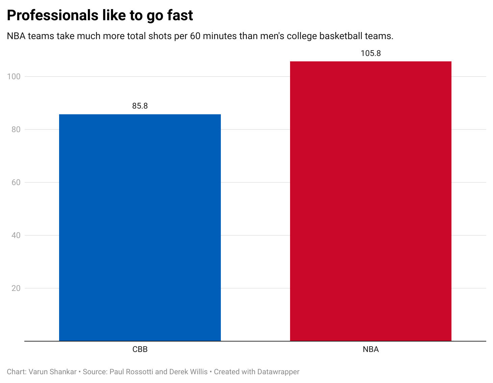
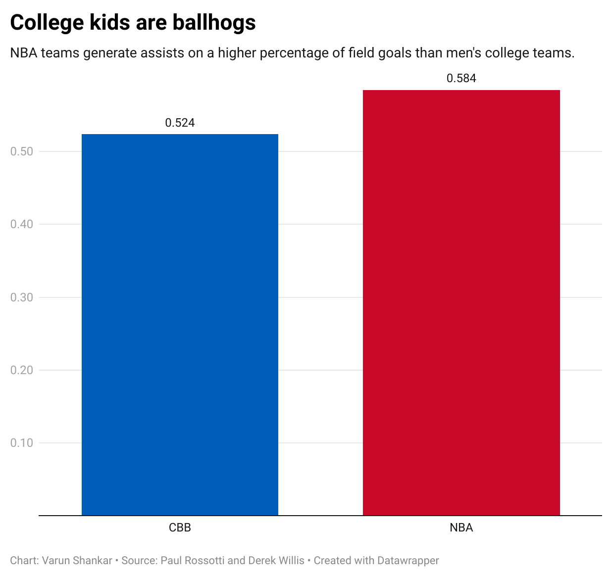
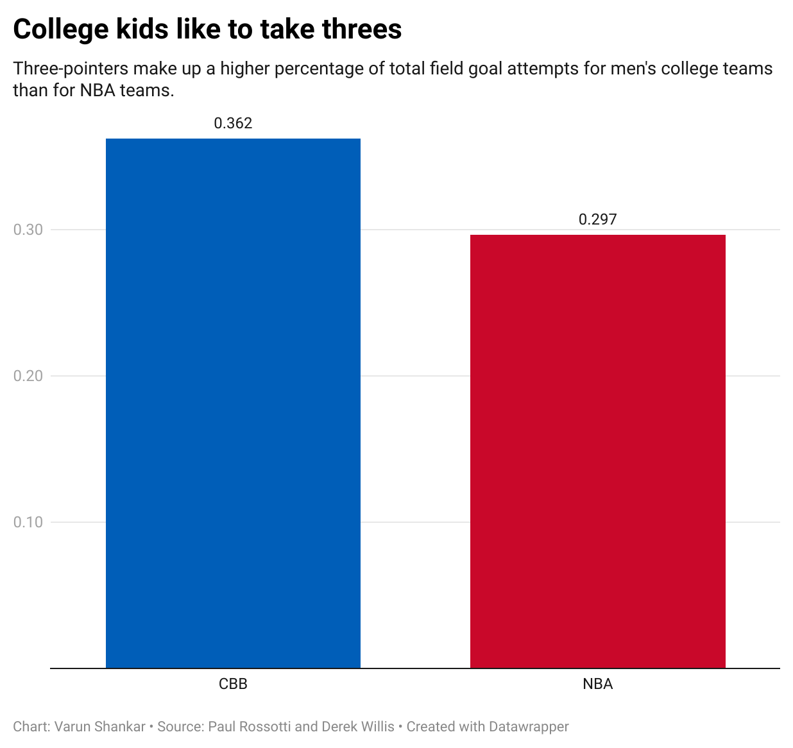
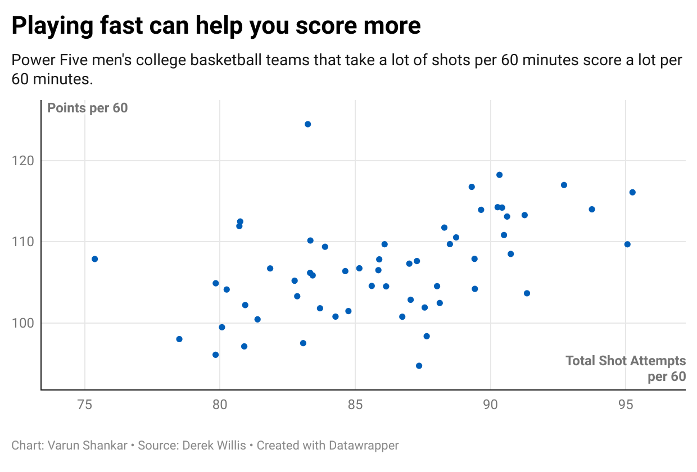
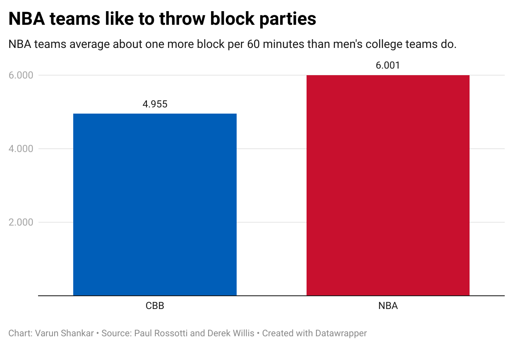

```{r setup, include=FALSE}
knitr::opts_chunk$set(echo = TRUE)
```

## R Markdown

The internet loves to debate about men's college basketball vs the NBA, specifically about the following question: Which sport is better to watch? I sought out to answer that question, focusing on three main areas:
- Pace, Shot Quality, Shot Location and Big Defensive Plays. 
To answer these, I identified various statistical areas I wanted to look at. For pace, I looked at total shot attempts per 60 minutes, for shot quality I looked at shooting percentages, assist percentages and total points per 60 minutes, for shot location I looked at three-point rate and free-throw rate and for big defensive plays I examined blocks per 60 minutes. 
Let's look at what I found. 

NBA teams like to play faster, which makes sense since there's a smaller shot clock. This can often lead to more fast-paced games that also lead to more comebacks (you can't hold the ball and play 4-corners).
```{r}
library(png)

```
When you look at assist percentage, it's clear that NBA teams pass the ball around much better than men's college teams. This probably comes because NBA teams feature better players across the board who can break down defenses. It also could be because on men's college teams, you're still close to a level of competition where if you have one good player, he can entirely dominate. 
```{r}

```
Men's college players make three-pointers a higher percentage of their total field goal attempts than NBA teams. This could be because you're often dealing with smaller players across the board and shooting is a "teachable" skill that coaches could emphasize. 
```{r}

```
```{r}

```
This graph shows a connection between playing fast and scoring a lot of points for individual men's college teams.

When we look at the defensive side of things, NBA teams are more prolific at swatting away opponent shot attempts. 
```{r}

```

This makes sense, NBA players are usually better athletes than men's college players and because of that, would be able to block more shots. In addition, the higher three-point rates in the college game mean NBA players get more opportunities to contest two-point shots, which are likely the ones that have a higher chance to be blocked.

Let's get into the process. Got the data online, wanted to standardize over the same time period so only used box scores from 2014 to 2018.

```{r}
CBBboxscores <- read_csv("https://dwillis.github.io/sports-data-files/cbblogs1522.csv")
CBBboxscores <- CBBboxscores %>% 
  mutate(year = year(Date)) %>% 
  filter(year >= 2014, year <= 2018) 

NBAboxscores <- read_csv("~/Documents/GitHub/jour479x_fall_2022/presentations/Presentation2/2012-18_officialBoxScore.csv") 

NBAboxscores <- NBAboxscores %>% mutate(year = year(gmDate)) %>% 
    filter(year >= 2014, year <= 2018)
```
```{r}
cols <- c("TeamFG", "TeamScore", "TeamFGA", "Team3P", "Team3PA")
CBBboxscores <- CBBboxscores %>% drop_na(any_of(cols))
  
nba_stat_profile <- NBAboxscores %>% 
  summarize(games = n(), points_per_60min = sum(teamPTS)/games *(60/48), total_shot_attempts_per_60 = sum(teamFGA)/games *(60/48), shooting_perc = sum(teamFGM)/sum(teamFGA), three_rate = sum(team3PA)/sum(teamFGA), free_throw_rate = sum(teamFTA)/sum(teamFGA), three_point_perc = sum(team3PM)/sum(team3PA), assist_perc = sum(teamAST)/sum(teamFGM), block_per60 = sum(teamBLK)/games*(60/48))

cbb_stat_profile <- CBBboxscores %>% 
  summarize(games = n(), points_per_60min = sum(TeamScore)/games *(60/40), total_shot_attempts_per_60 = sum(TeamFGA)/games *(60/40), shooting_perc = sum(TeamFG)/sum(TeamFGA), three_rate = sum(Team3PA)/sum(TeamFGA), free_throw_rate = sum(TeamFTA)/sum(TeamFGA), three_point_perc = sum(Team3P)/sum(Team3PA), assist_perc = sum(TeamAssists)/sum(TeamFG), block_per60 = sum(TeamBlocks)/games*(60/40))
```
Got rid of NAs and made statistical profiles for NBA and CBB that had
- points per 60, total shot attempts per 60, shooting percentage, three-point rate, free-throw rate, three-point percentage,  assist percentage and blocks per 60.


Making similar profiles for Power 5 v non-Power 5 schools and for individual conferences. 
```{r}
p5 <- c("Big Ten", "Big 12", "SEC", "ACC", "Pac-12")

p5_box_scores <- CBBboxscores %>% 
  filter(Conference == p5)

nonp5_box_scores <- CBBboxscores %>% 
  filter(Conference != p5)

b10_box_scores <- CBBboxscores %>% 
  filter(Conference == "Big Ten")

acc_box_scores <- CBBboxscores %>% 
  filter(Conference == "ACC")

b12_box_scores <- CBBboxscores %>% 
  filter(Conference == "Big 12")

pac12_box_scores <- CBBboxscores %>% 
  filter(Conference == "Pac-12")

sec_box_scores <- CBBboxscores %>% 
  filter(Conference == "SEC")

p5_stat_profile <- p5_box_scores %>% 
  summarize(games = n(), points_per_60min = sum(TeamScore)/games *(60/40), total_shot_attempts_per_60 = sum(TeamFGA)/games *(60/40), shooting_perc = sum(TeamFG)/sum(TeamFGA), three_rate = sum(Team3PA)/sum(TeamFGA), free_throw_rate = sum(TeamFTA)/sum(TeamFGA), three_point_perc = sum(Team3P)/sum(Team3PA), assist_perc = sum(TeamAssists)/sum(TeamFG), block_per60 = sum(TeamBlocks)/games*(60/40))

nonp5_stat_profile <- nonp5_box_scores %>% 
  summarize(games = n(), points_per_60min = sum(TeamScore)/games *(60/40), total_shot_attempts_per_60 = sum(TeamFGA)/games *(60/40), shooting_perc = sum(TeamFG)/sum(TeamFGA), three_rate = sum(Team3PA)/sum(TeamFGA), free_throw_rate = sum(TeamFTA)/sum(TeamFGA), three_point_perc = sum(Team3P)/sum(Team3PA), assist_perc = sum(TeamAssists)/sum(TeamFG), block_per60 = sum(TeamBlocks)/games*(60/40))

b10_stat_profile <- b10_box_scores %>% 
  summarize(games = n(), points_per_60min = sum(TeamScore)/games *(60/40), total_shot_attempts_per_60 = sum(TeamFGA)/games *(60/40), shooting_perc = sum(TeamFG)/sum(TeamFGA), three_rate = sum(Team3PA)/sum(TeamFGA), free_throw_rate = sum(TeamFTA)/sum(TeamFGA), three_point_perc = sum(Team3P)/sum(Team3PA), assist_perc = sum(TeamAssists)/sum(TeamFG), block_per60 = sum(TeamBlocks)/games*(60/40))

b12_stat_profile <- b12_box_scores %>% 
  summarize(games = n(), points_per_60min = sum(TeamScore)/games *(60/40), total_shot_attempts_per_60 = sum(TeamFGA)/games *(60/40), shooting_perc = sum(TeamFG)/sum(TeamFGA), three_rate = sum(Team3PA)/sum(TeamFGA), free_throw_rate = sum(TeamFTA)/sum(TeamFGA), three_point_perc = sum(Team3P)/sum(Team3PA), assist_perc = sum(TeamAssists)/sum(TeamFG), block_per60 = sum(TeamBlocks)/games*(60/40))

acc_stat_profile <- acc_box_scores %>% 
  summarize(games = n(), points_per_60min = sum(TeamScore)/games *(60/40), total_shot_attempts_per_60 = sum(TeamFGA)/games *(60/40), shooting_perc = sum(TeamFG)/sum(TeamFGA), three_rate = sum(Team3PA)/sum(TeamFGA), free_throw_rate = sum(TeamFTA)/sum(TeamFGA), three_point_perc = sum(Team3P)/sum(Team3PA), assist_perc = sum(TeamAssists)/sum(TeamFG), block_per60 = sum(TeamBlocks)/games*(60/40))

sec_stat_profile <- sec_box_scores %>% 
  summarize(games = n(), points_per_60min = sum(TeamScore)/games *(60/40), total_shot_attempts_per_60 = sum(TeamFGA)/games *(60/40), shooting_perc = sum(TeamFG)/sum(TeamFGA), three_rate = sum(Team3PA)/sum(TeamFGA), free_throw_rate = sum(TeamFTA)/sum(TeamFGA), three_point_perc = sum(Team3P)/sum(Team3PA), assist_perc = sum(TeamAssists)/sum(TeamFG), block_per60 = sum(TeamBlocks)/games*(60/40))

pac12_stat_profile <- pac12_box_scores %>% 
  summarize(games = n(), points_per_60min = sum(TeamScore)/games *(60/40), total_shot_attempts_per_60 = sum(TeamFGA)/games *(60/40), shooting_perc = sum(TeamFG)/sum(TeamFGA), three_rate = sum(Team3PA)/sum(TeamFGA), free_throw_rate = sum(TeamFTA)/sum(TeamFGA), three_point_perc = sum(Team3P)/sum(Team3PA), assist_perc = sum(TeamAssists)/sum(TeamFG), block_per60 = sum(TeamBlocks)/games*(60/40))
```
Joining all the stat profiles together. 
```{r}
cbb_stat_profile <- cbb_stat_profile %>% 
  mutate(name = "CBB") %>% 
  select(name, points_per_60min, total_shot_attempts_per_60, shooting_perc, three_rate, free_throw_rate, three_point_perc, assist_perc, block_per60)

nba_stat_profile <- nba_stat_profile %>% 
  mutate(name = "NBA") %>% 
  select(name, points_per_60min, total_shot_attempts_per_60, shooting_perc, three_rate, free_throw_rate, three_point_perc, assist_perc, block_per60)

nonp5_stat_profile <- nonp5_stat_profile %>% 
  mutate(name = "Non-Power Five") %>% 
  select(name, points_per_60min, total_shot_attempts_per_60, shooting_perc, three_rate, free_throw_rate, three_point_perc, assist_perc, block_per60)

p5_stat_profile <- p5_stat_profile %>% 
  mutate(name = "Power Five") %>% 
  select(name, points_per_60min, total_shot_attempts_per_60, shooting_perc, three_rate, free_throw_rate, three_point_perc, assist_perc, block_per60)

b10_stat_profile <- b10_stat_profile %>% 
  mutate(name = "Big Ten") %>% 
  select(name, points_per_60min, total_shot_attempts_per_60, shooting_perc, three_rate, free_throw_rate, three_point_perc, assist_perc, block_per60)

b12_stat_profile <- b12_stat_profile %>% 
  mutate(name = "Big 12") %>% 
  select(name, points_per_60min, total_shot_attempts_per_60, shooting_perc, three_rate, free_throw_rate, three_point_perc, assist_perc, block_per60)

sec_stat_profile <- sec_stat_profile %>% 
  mutate(name = "SEC") %>% 
  select(name, points_per_60min, total_shot_attempts_per_60, shooting_perc, three_rate, free_throw_rate, three_point_perc, assist_perc, block_per60)

pac12_stat_profile <- pac12_stat_profile %>% 
  mutate(name = "PAC-12") %>% 
  select(name, points_per_60min, total_shot_attempts_per_60, shooting_perc, three_rate, free_throw_rate, three_point_perc, assist_perc, block_per60)

acc_stat_profile <- acc_stat_profile %>% 
  mutate(name = "ACC") %>% 
  select(name, points_per_60min, total_shot_attempts_per_60, shooting_perc, three_rate, free_throw_rate, three_point_perc, assist_perc, block_per60)

stat_profiles <- bind_rows(cbb_stat_profile, nba_stat_profile, nonp5_stat_profile, p5_stat_profile, acc_stat_profile, sec_stat_profile, b12_stat_profile, b10_stat_profile, pac12_stat_profile)

write.csv(stat_profiles, "~/Documents/GitHub/jour479x_fall_2022/presentations/statprofiles.csv", row.names=TRUE)
```
Finding out the statistical profiles for individual CBB teams was a difficult task, will get to that lower. But NBA teams had better data and therefore could be grouped to see which teams excelled. Some takeaways:
- Unsurprisingly, Golden State led in points per 60 minutes. The Warriors also led in assist percentage, which makes sense due to their nature as a good passing team. 
- OKC was near the bottom with regard to assist percentage. This makes sense since their offense was dominated by the duo (and later solo act) of Durant and Westbrook.
- Houston had the highest three point rate, this makes sense because of their Moreyball philosophy which incentivized three-pointers and shots at the rim above all else. The Rockets also led in free throw rate, which again makes sense because those are very efficient shots and James Harden was well-equipped to get to the line. 
```{r}
NBAByTeam <- NBAboxscores %>% 
  group_by(teamAbbr) %>% 
  summarize(games = n(), points_per_60min = sum(teamPTS)/games *(60/48), total_shot_attempts_per_60 = sum(teamFGA)/games *(60/48), shooting_perc = sum(teamFGM)/sum(teamFGA), three_rate = sum(team3PA)/sum(teamFGA), free_throw_rate = sum(teamFTA)/sum(teamFGA), three_point_perc = sum(team3PM)/sum(team3PA), assist_perc = sum(teamAST)/sum(teamFGM), block_per60 = sum(teamBLK)/games*(60/48)) %>% 
  arrange(desc(assist_perc))
```
Alright, let's look at colleges. The issue here is that the data isn't great. That's easy to see just from the number of games, high-level programs like Maryland and Arizona have under 40 total games played in that time. Part of that is probably because there are just 343 teams listed in the TeamFull section while 952 are listed in the opponents setion. This makes looking for trends across  teams largely a futile exercise — it looks like this dataset only has information for some seasons for some teams. 
```{r}
CBBByTeam <- CBBboxscores %>% 
  group_by(TeamFull) %>% 
  summarize(games = n(), points_per_60min = sum(TeamScore)/games *(60/40), total_shot_attempts_per_60 = sum(TeamFGA)/games *(60/40), shooting_perc = sum(TeamFG)/sum(TeamFGA), three_rate = sum(Team3PA)/sum(TeamFGA), free_throw_rate = sum(TeamFTA)/sum(TeamFGA), three_point_perc = sum(Team3P)/sum(Team3PA), assist_perc = sum(TeamAssists)/sum(TeamFG), block_per60 = sum(TeamBlocks)/games*(60/40))

distinct(CBBboxscores, TeamFull)
distinct(CBBboxscores, Opponent)

```
For ex., Maryland is only here for the 2017-18 season. This does hurt some of the veracity of the data analysis done here, but hopefully the large sample should account for any variation in the data. 