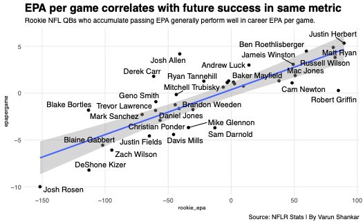

```{r setup, include=True}
knitr::opts_chunk$set(echo = TRUE)
library(tidyverse)
library(nflreadr)
library(ggalt)
library(ggrepel)
```

## R Markdown

There is nothing more valuable in football than a good quarterback on a rookie deal. Because of the salary cap and the high salaries quarterbacks receive, those who emerge as starters give their teams a significant advantage on the field because of their play and because of the players their teams can surround them with due to added financial flexibility. 

That makes quickly identifying whether a quarterback is worth building around paramount. However, because players generally tend to improve as they get further into their careers, teams need to be able to project their performance. What stats can they look at to estimate future passing performance? Let's take a look, comparing various statistical categories in players' rookie seasons to their career passing expected points added per game. 

I did not factor in rushing statistics into the first part of this presentation. I wanted to limit the scope of the regression to pure passing performance to avoid any overwhelming schematic bias toward quarterbacks in more recent years who had more robust rushing schemes designed for them.

```{r}
knitr::opts_chunk$set(echo = TRUE)
library(png)

```
When you run the regression between rookie year total pasing expected points added and the quarterback's career passing EPA/game, you get a pretty strong correlation, with an R^2 of .6605 and a p-value well below .05, showing statistical significance. Looking at the graph also shows that — good quarterbacks like Russell Wilson, Cam Newton and Justin Herbert all racked up solid expected points added as rookies and turned that success into good career numbers. 

Bad quarterbacks like Josh Rosen and Blaine Gabbert stumbled in their first year and never found their footing. The major outlier is Josh Allen, who was not good as a rookie but is now is fantastic. However, this graph shows that few quarterbacks who are positive in passing EPA as rookies end up as busts (explained further below).

Now, this is a bit of cheating. You're comparing very similar stats here, total passing EPA and passing EPA per game. That probably factors into the strong correlation, but this does make sense. Passing EPA is a more advanced metric than anything else that's being used to examine a correlation because it factors in a variety of factors including score, down, distance and time. 

```{r}

```
Rookie year passing touchdowns don't have the similar amount of success. Many good quarterbacks, including Matt Ryan, Lamar Jackson and Ben Roethlisberger did not throw for many touchdowns as rookies but still had great careers. 

There are multiple explanations for this, the main one being that touchdowns are just one play. If a quarterback leads his offense to the one-yard line and the running back leaps over the pile, th quarterback doesn't get that touchdown. That's shown in this regression's R^2, which is at .1761. That's higher than most of the other statistics we compared, but still not great. 

Let's look at how we got here, starting with loading player statistics and draft status.
```{r}
game_by_game_stats <- load_player_stats(
  seasons = TRUE,
  stat_type = c("offense"),
  file_type = getOption("nflreadr.prefer", default = "rds")
)

draft_status <- load_players(file_type = getOption("nflreadr.prefer", default = "rds")) %>% 
  select(display_name, gsis_id, position, draft_number, draft_round, rookie_year)
```
Now, let's group this by player names and id, and find out their total career passing EPA, games played, passing yards and passing touchdowns. To add up passing EPA, I excluded all players who had NA passing EPA numbers. I then divided the total passing EPA by career games
```{r}
total_stats <- game_by_game_stats %>% 
  filter(!is.na(passing_epa)) %>% 
  group_by(player_display_name, player_id, position) %>% 
  summarize(total_epa = sum(passing_epa), career_games = n(), carr_pass_yards = sum(passing_yards), carr_pass_TD = sum(passing_tds)) %>% 
  mutate(epapergame = total_epa/career_games)
```
Now, let's join the box score data with the draft statuses and filter out any player whose rookie year was not recorded.

Then, let's filter for quarterbacks drafted in the Top 100 picks and find out how they performed as rookies, examining total games played, completion percentage, passing yards, passing touchdowns, interceptions, sacks taken, passing air yards, passing first downs and passing EPA during the regular season.
```{r}
game_by_game_stats_with_draft <- game_by_game_stats %>% inner_join(draft_status, by=c("player_id"="gsis_id")) 

game_by_game_stats_with_draft <- game_by_game_stats_with_draft %>% 
    filter(!is.na(rookie_year))

rookie_years_only <- game_by_game_stats_with_draft %>% filter(season == rookie_year, draft_number < 100, position.x == "QB", season_type == "REG")

rookie_years_only <- rookie_years_only %>% 
  group_by(player_display_name, player_id) %>% 
  summarize(rookie_games = n(), completion_perc = sum(completions)/sum(attempts), pass_yards = sum(passing_yards), pass_TD = sum(passing_tds), ints = sum(interceptions), sacks_taken = sum(sacks), pass_air_yards = sum(passing_air_yards), pass_first_downs = sum(passing_first_downs), rookie_epa = sum(passing_epa))
```
Now, let's merge the rookie stats table with total stats and draft status. Then, let's filter for players who played at least 10 games as rookies to exclude players who got very limited action in their first year.
```{r}
final_data_table <- rookie_years_only %>% left_join(total_stats, by=c("player_id", "player_display_name")) 

final_data_table <- final_data_table %>% left_join(draft_status, by=c("player_id"="gsis_id")) 

final_data_table <- final_data_table %>% 
  filter(rookie_games > 10)

mutate(is.NA(Day1)=0)
```
Now, let's run a regression between the following stats as the independent variable:
completion percentage, passing yards, passing touchdowns, interceptions, sacks taken, passing air yards, passing first downs and rookie year passing EPA
And career passing EPA per game as the dependent variable. 
```{r}
comp_perc_fit <- lm(epapergame ~ completion_perc, data = final_data_table)
summary(comp_perc_fit)

passyds_fit <- lm(epapergame ~ pass_yards, data = final_data_table)
summary(passyds_fit)

passtds_fit <- lm(epapergame ~ pass_TD, data = final_data_table)
summary(passtds_fit)

int_fit <- lm(epapergame ~ ints, data = final_data_table)
summary(int_fit)

sacks_fit <- lm(epapergame ~ sacks_taken, data = final_data_table)
summary(sacks_fit)

air_yards_fit <- lm(epapergame ~ pass_air_yards, data = final_data_table)
summary(air_yards_fit)

first_downs_fit <- lm(epapergame ~ pass_first_downs, data = final_data_table)
summary(first_downs_fit)

rookie_epa_fit <- lm(epapergame ~ rookie_epa, data = final_data_table)
summary(rookie_epa_fit)
```

Okay so, lot of stuff happened here. I ran regressions for each of the rookie year stats I gathered and the career passing EPA per game and looked at the r^2 values. Let's review what we saw
Completion Percentage
- p-value is less than .05 so this is a statistically significant relationship, but adjusted R^2 is just 0.1385, meaning that rookie year completion percentage can only explain about 14 percent of career passing EPA/game.
Pass Yards
- Again, p-value is less than .05, making this statistically signifcant. Adjusted R^2 is 0.09509, even worse than completion percentage. Yikes
Pass TDs
- P value is less than .05, makes this statistically significant. However, R^2 here is 0.1615, the highest so far but still not ideal.
Ints
- Not a statistically sig relationship. Doesn't seem to matter if qbs throw a bunch of picks as rookies (we call this the Peyton Manning theory)
Sacks
- p-value below .05, 0.1793 R^2 value, the highest so far.
Air-yards
- Not a statistically sig relationship
Passing first downs
- Statistically signifcant relationship but only a R^2 value of 0.09374. 
Rookie year passing EPA
- Best relationship at .6605

Let's briefly dive deeper into the sacks. Modern analysis revealed that sacks are as much a quarterback-driven stat as an offensive line-driven one. That shows up here. Great mobile quarterbacks like Lamar Jackson and Jalen Hurts avoided many sacks because of the run-heavy schemes they played. Pro-ready Matt Ryan stepped in and got the ball out efficiently. On the other hand, quarterbacks who are known to extend plays, like Russell Wilson and Ben Roethlisberger, took a lot of sacks. 


```{r}
ggplot() + 
  geom_point(data=final_data_table, aes(x=sacks_taken, y=epapergame)) +
  geom_smooth(data=final_data_table, aes(x=sacks_taken, y=epapergame), method="lm") + 
  labs(title="Sacks taken correlates negatively with future quarterback success", subtitle="Even great quarterbacks took many sacks as rookies.", caption="Source: NFLR Stats | By Varun Shankar")  + theme_minimal() +
  theme(
    plot.title = element_text(size = 16, face = "bold"),
    axis.title = element_text(size = 8), 
    plot.subtitle = element_text(size=10), 
    panel.grid.minor = element_blank()
    )  +
  geom_text_repel(
    data=final_data_table, 
    aes(x=sacks_taken, y=epapergame, label=player_display_name))  
```

Let's go back to the top with rookie year passing EPA. Quarterbacks are not usually good in their first seasons, only 13 quarterbacks drafted in the top 100 picks have finished with positive expected points added as rookies. The mean career passing EPA for those players is 340.28 and the median is 166.27. Let's see where those numbers would rank among the data we have. 
```{r}
positive_rookies <- final_data_table %>% 
  filter(rookie_epa > 0)
positive_rookies
```
That gives us 13 quarterbacks, let's see how they look in career EPA.
```{r}
ggplot() + 
  geom_lollipop(
    data=positive_rookies, 
    aes(y=reorder(player_display_name
, epapergame), x=epapergame), 
    horizontal = TRUE
    ) + 
  theme_minimal() + 
  labs(title = "Most positive rookie quarterbacks end up as productive starters", y="Quarterback", subtitle="Sorting QBs who had positive rookie year passing EPAs by career passing EPA/game.", caption="Source: NFLR Stats | By Varun Shankar") 
```
Almost all these players (except Wentz and Griffin) had prolonged stretches of above-average quarterback play in their careers. 
```{r}
summary(positive_rookies$total_epa)
```

```{r}
qb_stats <- total_stats %>% 
  filter(position == "QB") %>% 
  arrange(desc(total_epa))

qb_stats
```

339.90 puts us somewhere between 21 and 22nd on this list, between Eli Manning and Jimmy Garoppolo. 166.27 puts us just above Cam Newton. 

How does this change when you factor in rushing performance? A brief look, doing the same stuff as above but adding in rushing EPA. 

```{r}
game_by_game_stats <- load_player_stats(
  seasons = TRUE,
  stat_type = c("offense"),
  file_type = getOption("nflreadr.prefer", default = "rds")
)

draft_status <- load_players(file_type = getOption("nflreadr.prefer", default = "rds")) %>% 
  select(display_name, gsis_id, position, draft_number, draft_round, rookie_year)

total_stats <- game_by_game_stats %>% 
  filter(!is.na(passing_epa), !is.na(rushing_epa)) %>% 
  group_by(player_display_name, player_id, position) %>% 
  summarize(total_epa = sum(passing_epa)+sum(rushing_epa), career_games = n())

game_by_game_stats_with_draft <- game_by_game_stats %>% inner_join(draft_status, by=c("player_id"="gsis_id")) 


game_by_game_stats_with_draft <- game_by_game_stats_with_draft %>% 
    filter(!is.na(rookie_year), !is.na(passing_epa), !is.na(rushing_epa))

rookie_years_only <- game_by_game_stats_with_draft %>% filter(season == rookie_year, draft_number < 100, position.x == "QB", season_type == "REG")

rookie_years_only <- rookie_years_only %>% 
  group_by(player_display_name, player_id) %>% 
  summarize(rookie_games = n(), completion_perc = sum(completions)/sum(attempts), pass_yards = sum(passing_yards), pass_TD = sum(passing_tds), ints = sum(interceptions), sacks_taken = sum(sacks), pass_air_yards = sum(passing_air_yards), pass_first_downs = sum(passing_first_downs), rookie_epa = sum(passing_epa)+sum(rushing_epa))

final_data_table <- rookie_years_only %>% left_join(total_stats, by=c("player_id", "player_display_name")) 

final_data_table <- final_data_table %>% left_join(draft_status, by=c("player_id"="gsis_id")) 

final_data_table <- final_data_table %>% 
  filter(rookie_games > 10) %>% 
  mutate(epapergame = total_epa/career_games)
```
```{r}
comp_perc_fit <- lm(epapergame ~ completion_perc, data = final_data_table)
summary(comp_perc_fit)

passyds_fit <- lm(epapergame ~ pass_yards, data = final_data_table)
summary(passyds_fit)

passtds_fit <- lm(epapergame ~ pass_TD, data = final_data_table)
summary(passtds_fit)

int_fit <- lm(epapergame ~ ints, data = final_data_table)
summary(int_fit)

sacks_fit <- lm(epapergame ~ sacks_taken, data = final_data_table)
summary(sacks_fit)

air_yards_fit <- lm(epapergame ~ pass_air_yards, data = final_data_table)
summary(air_yards_fit)

first_downs_fit <- lm(epapergame ~ pass_first_downs, data = final_data_table)
summary(first_downs_fit)

rookie_epa_fit <- lm(epapergame ~ rookie_epa, data = final_data_table)
summary(rookie_epa_fit)
```

Quick summary:
Relationship w completion percentage went up -> 0.1502
Relationship w pass yards went up -> 0.157
Relationship w pass TD went up 0 -> 0.188
Ints are still not statistically significant, p-value of 0.2755
Sacks taken also not statistically signifcant
Air yards not statistically significant
Passing first downs  went up -> 0.1504
Rookie year EPA goes down -> 0.5331

```{r}
ggplot() + 
  geom_point(data=final_data_table, aes(x=rookie_epa, y=epapergame)) +
  geom_smooth(data=final_data_table, aes(x=rookie_epa, y=epapergame), method="lm")   +
  labs(title="RGIII looked destined for NFL stardom after rookie year.", subtitle="Factoring in rushing EPA helps quarterbacks like Griffin and Cam Newton.", caption="Source: NFLR Stats | By Varun Shankar")  + theme_minimal() +
  theme(
    plot.title = element_text(size = 16, face = "bold"),
    axis.title = element_text(size = 8), 
    plot.subtitle = element_text(size=10), 
    panel.grid.minor = element_blank()
    )  +
  geom_text_repel(
    data=final_data_table, 
    aes(x=rookie_epa, y=epapergame, label=player_display_name))  
```
Interceptions are obviously bad, but they don't seem to correlate with future success, let's look at a graph to examine this further.

```{r}
ggplot() + 
  geom_point(data=final_data_table, aes(x=ints, y=epapergame)) +
  geom_smooth(data=final_data_table, aes(x=ints, y=epapergame), method="lm")   +
  xlim(0, 30) +
  labs(title="Rookie quarterbacks who throw picks can still succeed.", subtitle="The relationship between rookie year interceptions and career EPA/game isn't statistically significant.", caption="Source: NFLR Stats | By Varun Shankar")  + theme_minimal() +
  theme(
    plot.title = element_text(size = 16, face = "bold"),
    axis.title = element_text(size = 8), 
    plot.subtitle = element_text(size=10), 
    panel.grid.minor = element_blank()
    )  +
  geom_text_repel(
    data=final_data_table, 
    aes(x=ints, y=epapergame, label=player_display_name))  
```
So yeah, not a strong correlation here, as witnessed by the near-horizontal line. You see future NFL stars like Andrew Luck throwing many interceptions and future benchwarmers like Sam Darnold avoiding giving the ball away. Data wasn't available from his rookie season, but a prime example of a player whose interceptions didn't matter was Peyton Manning, who threw 28 picks as a rookie, more than anyone else on this list, but obviously flourished through the rest of his career. 